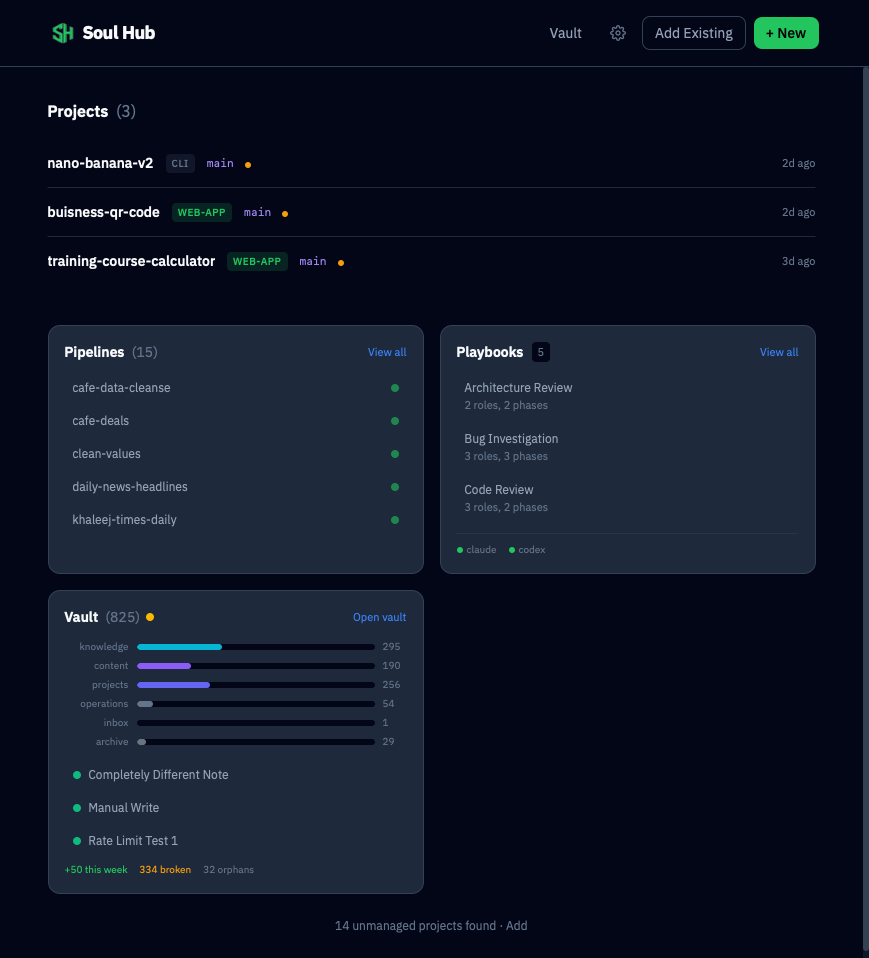
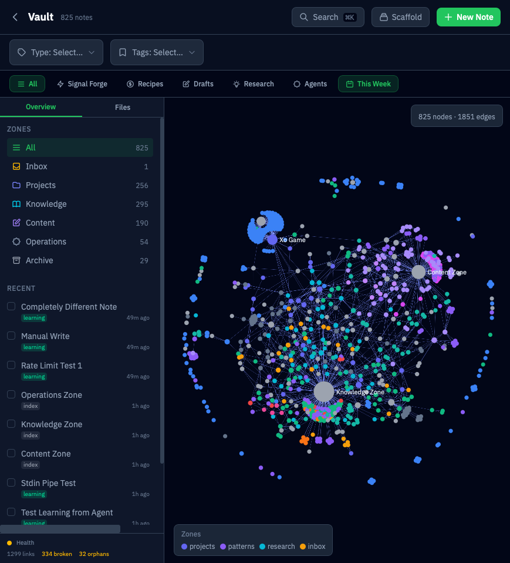
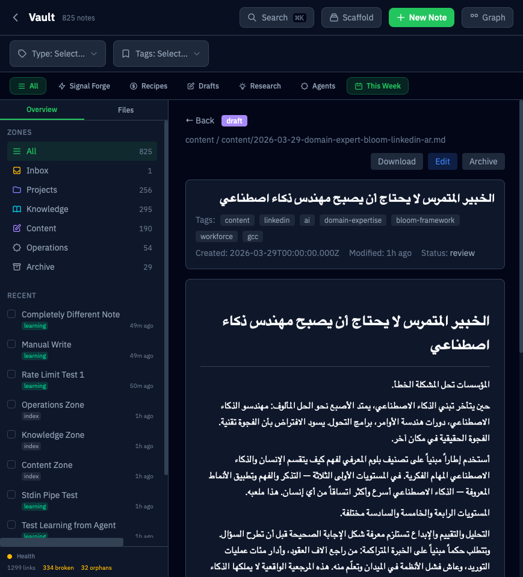
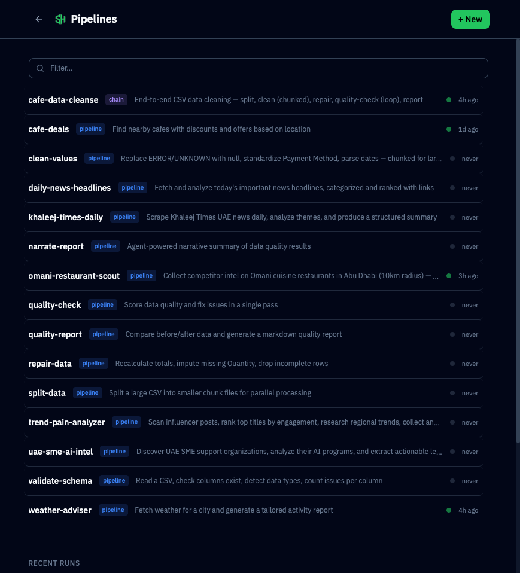

# Soul Hub

<p align="center">
  
</p>

A local-first, single-user **ambient AI command center**. Talk to it from WhatsApp or Telegram, triage your inbox, and grow a governed knowledge vault — all running on your own machine and orchestrated by Claude Code.



## What It Does

**Chat (WhatsApp + Telegram)** — Message Soul Hub like you'd message a person. A Claude-powered orchestrator routes each request to the right tool: search the vault, draft a note, read your inbox, run a search, set a reminder. Conversations are stateful, and the assistant streams its progress back as it works.

**Unified Inbox** — Connect an email account and let the assistant surface what matters: queued messages, drill-downs, and reply drafts — driven from chat or the web UI, with notifications routed to the channel you choose.

**Vault** — A governed, Obsidian-compatible knowledge graph with 6 zones, 60+ note types, full-text search, smart filters, and Arabic RTL support. Every agent write is validated, rate-limited, deduplicated, and audited. Pipeline outputs and session logs are captured automatically.




**Pipelines** — Build multi-step data pipelines (Python, Bash, Node.js) with a visual editor. Chain pipelines into a DAG, run them on cron schedules, trigger via webhooks, or watch a folder. Agent steps run Claude Code autonomously.



**Terminal** — Full `node-pty` + xterm.js terminal sessions in the browser, with session logging and history — launch a Claude Code session from anywhere.

**Scheduler** — A unified view of every scheduled job (pipelines, reminders, maintenance) with countdowns, a mini-timeline, and run history.

## Quick Start

```bash
# Clone and install
git clone https://github.com/jneaimi/soulhub.git
cd soulhub
npm install

# Configure env (required for the Unified Inbox + chat channels, optional otherwise)
cp .env.example .env
echo "SOUL_HUB_SECRET=$(node -e 'console.log(require("crypto").randomBytes(32).toString("hex"))')" >> .env
# Add any API keys you need to .env

# Configure paths (copy the template and edit if your claude binary isn't at ~/.local/bin/claude)
mkdir -p ~/.soul-hub
cp settings.example.json ~/.soul-hub/settings.json

# Initialize the vault
mkdir -p ~/vault

# Run in development
npm run dev
# Open http://localhost:5173
```

### Production with PM2

```bash
# Build the app
npm run build

# Start with PM2 (includes Cloudflare tunnel + WhatsApp worker if configured)
npm run prod:start
# Open http://localhost:2400

# Other production commands
npm run prod:reload     # Zero-downtime reload
npm run prod:status     # Show process status
npm run prod:logs       # Tail logs
npm run prod:stop       # Stop all processes
npm run prod:startup    # Enable auto-start on boot
```

The PM2 config (`ecosystem.config.cjs`) runs three processes:
- **soul-hub** — The SvelteKit app on port 2400 (auto-restart)
- **soul-hub-tunnel** — Cloudflare Tunnel for remote access (optional)
- **soul-hub-whatsapp** — WhatsApp channel worker (optional)

See [INSTALL.md](INSTALL.md) for detailed setup instructions.

## Requirements

| Requirement | Version | Required | Install |
|------------|---------|----------|---------|
| **Node.js** | 22.6+ | Yes | [nodejs.org](https://nodejs.org/) or `brew install node` |
| **Claude Code** | Latest | Yes | [docs.anthropic.com](https://docs.anthropic.com/en/docs/claude-code) |
| **uv** | Latest | For Python pipelines | [docs.astral.sh/uv](https://docs.astral.sh/uv/getting-started/installation/) |
| **PM2** | 5+ | For production | Included as dev dependency |

**Platforms**: macOS (Intel + Apple Silicon), Linux (Ubuntu 20.04+, Debian 11+)

## Architecture

```
soulhub/
├── src/                    # SvelteKit app (frontend + API)
│   ├── routes/             # Pages and API endpoints
│   ├── lib/
│   │   ├── orchestrator-v2/# Claude orchestrator (tools, routing, streaming)
│   │   ├── channels/       # WhatsApp + Telegram channel adapters
│   │   ├── inbox/          # Unified inbox (accounts, triage, drafts)
│   │   ├── pipeline/       # Pipeline engine (parser, runner, scheduler)
│   │   ├── vault/          # Vault engine (indexer, search, graph, governance)
│   │   ├── pty/            # Terminal manager (node-pty sessions)
│   │   ├── persona/        # Operator persona + identity loader
│   │   └── components/     # Svelte UI components
├── pipelines/              # User pipelines live here
│   └── _builder/           # Builder system (templates, components, docs)
├── cli/                    # The `soul` CLI (bash-native API wrapper)
├── static/                 # Static assets
├── server.js               # Custom Node.js server (SSE, WebSocket)
└── ecosystem.config.cjs    # PM2 production config
```

### Tech Stack

- **Frontend**: SvelteKit + Svelte 5 + Tailwind CSS v4
- **Backend**: SvelteKit API routes + custom Node.js server
- **Orchestrator**: Claude (Opus / Sonnet / Haiku) with a tool registry + streaming
- **Channels**: WhatsApp (Baileys) + Telegram bot
- **Terminal**: node-pty + xterm.js
- **Pipeline Engine**: Custom DAG runner with chunk/loop/conditional support
- **Vault**: File-based markdown with YAML frontmatter, wikilinks, full-text search (MiniSearch)
- **Production**: PM2 process manager + Cloudflare Tunnel

## Configuration

Soul Hub stores user state under `~/.soul-hub/` (override with `SOUL_HUB_HOME`). It looks for `~/.soul-hub/settings.json`; all settings have sensible defaults.

```json
{
  "paths": {
    "devDir": "~/dev",
    "vaultDir": "~/vault",
    "claudeBinary": "~/.claude/bin/claude"
  },
  "server": {
    "port": 2400
  },
  "terminal": {
    "fontSize": 13,
    "cols": 120,
    "rows": 40
  }
}
```

Some modules ship behind feature flags and are off by default (`features` in `settings.json`). See [INSTALL.md](INSTALL.md) for all configuration options.

## API Keys

All API keys are optional. Core features (vault, terminal, pipelines) work without any keys. Chat channels and the inbox need their respective credentials; pipeline blocks that call specific APIs will show which keys are missing.

Copy `.env.example` to `.env` and add the keys you need.

## Vault API

The vault exposes a REST API for programmatic access:

| Endpoint | Method | Purpose |
|----------|--------|---------|
| `/api/vault` | GET | Overview (stats, zones) |
| `/api/vault/notes` | GET | Search/list with filters |
| `/api/vault/notes` | POST | Create note (governance-validated) |
| `/api/vault/notes/[path]` | GET/PUT/DELETE | Read, update, archive note |
| `/api/vault/graph` | GET | Knowledge graph (nodes + edges) |
| `/api/vault/writes` | GET | Agent write audit trail |
| `/api/vault/agent-context` | GET | Pre-fetch context for agent tasks |
| `/api/vault/health` | GET | Vault health report |
| `/api/vault/tags` | GET | Tag taxonomy with counts |
| `/api/vault/reindex` | POST | Force full reindex |

The bundled `soul` CLI wraps this API for the shell: `soul vault search`, `soul note create`, `soul doctor`, and more. Run `soul --help` after install.

## Remote Access (Optional)

Access Soul Hub from anywhere via Cloudflare Tunnel — includes a dev project preview proxy (`pXXXX.soul-hub.yourdomain.com`). See the full guide with screenshots: [docs/tunnel-guide/TUNNEL.md](docs/tunnel-guide/TUNNEL.md)

## License

MIT — see [LICENSE](LICENSE).
