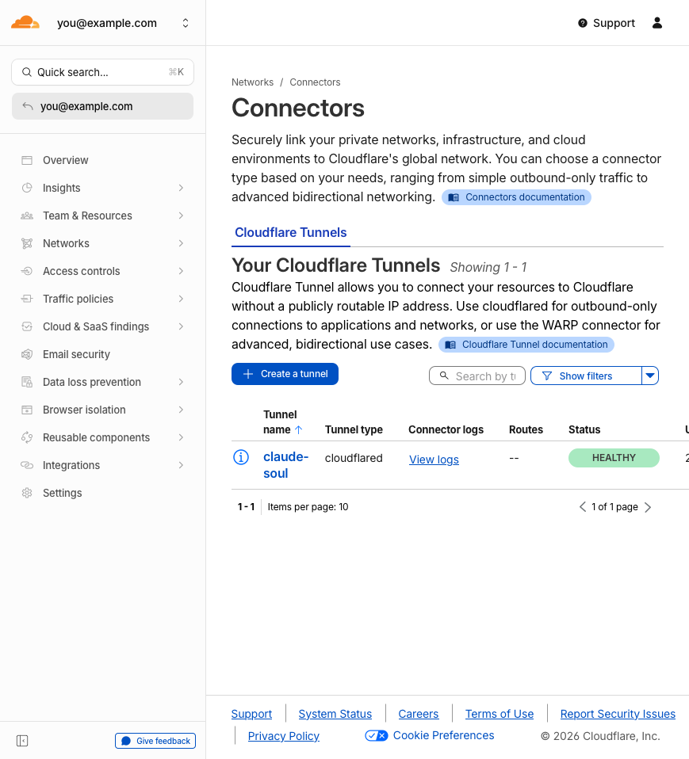
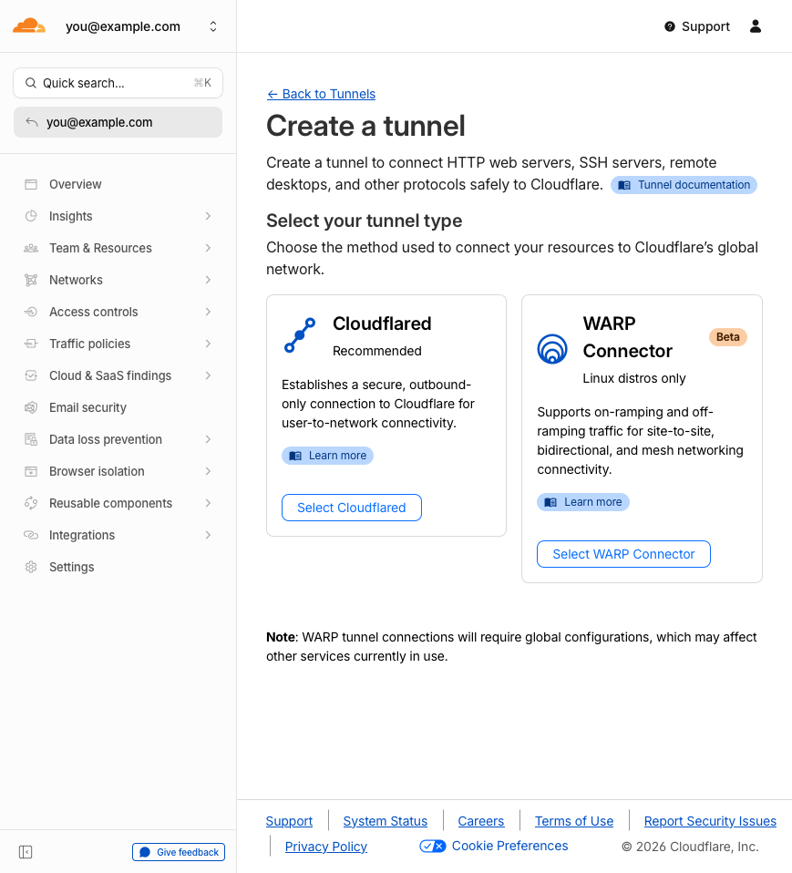
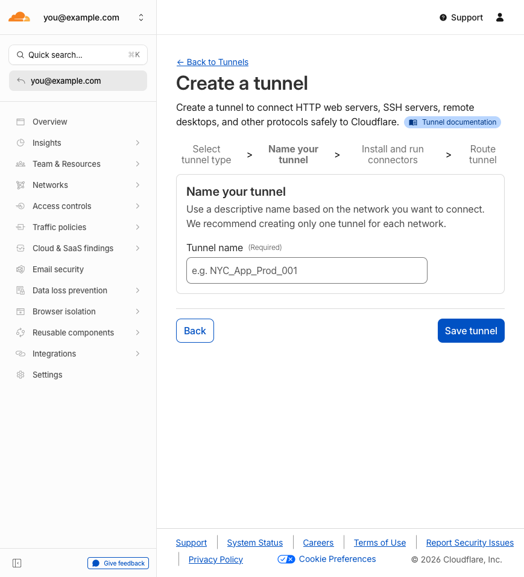

# Cloudflare Tunnel Setup Guide

This guide walks you through setting up a Cloudflare Tunnel to access Soul Hub remotely from anywhere. This is optional — Soul Hub works on `localhost` without it.

## What You Get

With a Cloudflare Tunnel, you can:
- Access Soul Hub from any device (phone, tablet, laptop) via `soul-hub.yourdomain.com`
- Access dev project previews via `pXXXX.soul-hub.yourdomain.com` (port proxy)
- No port forwarding, no firewall rules, no static IP needed
- HTTPS by default with Cloudflare's certificate
- Optional: Lock access behind Cloudflare Access (email-based auth, SSO)

## Prerequisites

- A Cloudflare account (free tier works)
- A domain managed by Cloudflare (add one at [dash.cloudflare.com](https://dash.cloudflare.com))
- `cloudflared` binary installed on your machine

## Step 1: Install cloudflared

**macOS:**
```bash
brew install cloudflare/cloudflare/cloudflared
```

**Linux (Debian/Ubuntu):**
```bash
curl -L https://github.com/cloudflare/cloudflared/releases/latest/download/cloudflared-linux-amd64.deb -o cloudflared.deb
sudo dpkg -i cloudflared.deb
```

**Linux (Other):**
```bash
curl -L https://github.com/cloudflare/cloudflared/releases/latest/download/cloudflared-linux-amd64 -o /usr/local/bin/cloudflared
chmod +x /usr/local/bin/cloudflared
```

Verify installation:
```bash
cloudflared --version
```

## Step 2: Authenticate with Cloudflare

```bash
cloudflared tunnel login
```

This opens your browser. Select the domain you want to use. A certificate is saved to `~/.cloudflared/cert.pem`.

## Step 3: Create a Tunnel

Go to the **Cloudflare Dashboard** > **Zero Trust** > **Networks** > **Connectors**.



Click **"Create a tunnel"**.

### Select tunnel type

Choose **Cloudflared** (not WARP Connector):



### Name your tunnel

Enter a name like `soul-hub`:



Click **Save tunnel**.

### Install the connector

Cloudflare shows you the install command with your tunnel token. Copy it and run it on your machine:

```bash
# The dashboard shows this command with your unique token
cloudflared service install <YOUR_TOKEN>
```

**Or** if you prefer manual control (recommended for Soul Hub), skip the service install and use the CLI directly — we'll configure PM2 to manage it.

## Step 4: Configure the Tunnel

Create or edit `~/.cloudflared/config.yml`:

```yaml
tunnel: <TUNNEL_ID>
credentials-file: /Users/<you>/.cloudflared/<TUNNEL_ID>.json

ingress:
  # Soul Hub main app
  - hostname: soul-hub.yourdomain.com
    service: http://localhost:2400

  # Wildcard for port proxy (dev project previews)
  - hostname: "*.soul-hub.yourdomain.com"
    service: http://localhost:2400

  # Catch-all (required by cloudflared)
  - service: http_status:404
```

**Find your tunnel ID:**
```bash
cloudflared tunnel list
```

### Port Proxy (Optional but Powerful)

The wildcard rule `*.soul-hub.yourdomain.com` enables Soul Hub's port proxy feature. When you run a dev server (e.g., Vite on port 5173), you can access it at:

```
https://p5173.soul-hub.yourdomain.com
```

Soul Hub's built-in proxy server routes `pXXXX` subdomains to `localhost:XXXX`. This means you can preview any local dev server remotely.

## Step 5: Add DNS Records

Go to **Cloudflare Dashboard** > your domain > **DNS** > **Records**.

Add two CNAME records:

| Type | Name | Target | Proxy |
|------|------|--------|-------|
| CNAME | `soul-hub` | `<TUNNEL_ID>.cfargotunnel.com` | Proxied (orange cloud) |
| CNAME | `*.soul-hub` | `<TUNNEL_ID>.cfargotunnel.com` | Proxied (orange cloud) |

**Or** use the CLI:
```bash
cloudflared tunnel route dns <TUNNEL_NAME> soul-hub.yourdomain.com
cloudflared tunnel route dns <TUNNEL_NAME> "*.soul-hub.yourdomain.com"
```

> **Note:** Wildcard DNS (`*.soul-hub`) requires the domain to be on Cloudflare's proxy (orange cloud). Free tier supports this.

## Step 6: Test the Tunnel

Start the tunnel manually:
```bash
cloudflared tunnel run soul-hub
```

Then open `https://soul-hub.yourdomain.com` in your browser.

## Step 7: Run with PM2 (Production)

Soul Hub's `ecosystem.config.cjs` already includes a tunnel process. Just update it with your tunnel name:

```javascript
// In ecosystem.config.cjs — the tunnel entry is already there:
{
  name: 'soul-hub-tunnel',
  script: 'cloudflared',
  args: 'tunnel run soul-hub',  // ← your tunnel name
  autorestart: true,
}
```

Start everything:
```bash
./scripts/start_prod.sh start
```

Both the Soul Hub server and tunnel start together via PM2.

## Securing Remote Access (Optional)

### Cloudflare Access

For production use, add authentication via Cloudflare Access:

1. Go to **Zero Trust** > **Access** > **Applications**
2. Click **Add an application** > **Self-hosted**
3. Set the application domain: `soul-hub.yourdomain.com`
4. Add a policy:
   - **Allow** > **Emails** > your email address
   - Or use SSO (Google, GitHub, etc.)
5. Save

This adds an authentication page before anyone can access Soul Hub.

### Service Token (API Access)

If you need programmatic access (webhooks, API calls):

1. Go to **Zero Trust** > **Access** > **Service Auth** > **Service Tokens**
2. Create a token
3. Add to your `.env`:
   ```
   CF_ACCESS_CLIENT_ID=<your-client-id>
   CF_ACCESS_CLIENT_SECRET=<your-client-secret>
   ```
4. Include these headers in API requests:
   ```
   CF-Access-Client-Id: <your-client-id>
   CF-Access-Client-Secret: <your-client-secret>
   ```

> **Service tokens only work when the calling service can send custom HTTP
> headers.** Third-party webhooks (Telegram, Stripe, GitHub, Twilio, …)
> cannot — they POST to your URL with their own headers and don't follow
> SSO redirects. For those, use the **Webhook Bypass Policy** pattern below.

### Webhooks behind Access (Bypass Policy)

When your host (e.g. `soul-hub.yourdomain.com`) is protected by Cloudflare
Access, every path under it inherits the SSO gate by default. A webhook
provider trying to POST to your URL gets back HTTP `302` to the Cloudflare
login page, which it cannot follow. The webhook fails silently and the
provider records something like:

```json
{ "last_error_message": "Wrong response from the webhook: 302 Found" }
```

The fix is a *separate* Access application scoped to just the webhook path,
with a **Bypass** policy. Cloudflare evaluates path-specific apps before
the broad host app, so this carves out the webhook URL without weakening
your dashboard auth.

**Pattern:**

1. Go to **Zero Trust** > **Access** > **Applications** > **Add an application**
2. Type: **Self-hosted**
3. Application URL — **path must match the actual webhook route exactly**:
   ```
   soul-hub.yourdomain.com/api/channels/telegram/_webhook
   ```
   Do not omit the `/api/` prefix or any path segment — Cloudflare matches
   literally. A typo here means the broad host app catches the request
   and returns 302.
4. Add a policy:
   - **Name:** `<provider> webhook bypass` (e.g. `Telegram webhook bypass`)
   - **Action:** `Bypass`
   - **Include rule:** required — without one the policy matches no one
     and falls through to deny.
     - **Loose option:** Selector `Everyone` (relies entirely on the
       provider's signing secret as your auth boundary)
     - **Tight option (recommended):** Selector `IP ranges`, with the
       provider's published webhook CIDRs as the value. For Telegram:
       ```
       149.154.160.0/20, 91.108.4.0/22
       ```
5. Save the application.

**Validation:**

```bash
# 1. From your laptop with IP-range filter — expect 403 from Access
#    (your IP isn't in the provider's CIDR set). This is CORRECT.
curl -i -X POST https://soul-hub.yourdomain.com/api/channels/telegram/_webhook \
  -H 'Content-Type: application/json' -d '{}'

# 2. Force the provider to retry (Telegram example) — drops backlog +
#    clears any cached error.
curl -s "https://api.telegram.org/bot${TOKEN}/setWebhook" \
  --data-urlencode "url=https://soul-hub.yourdomain.com/api/channels/telegram/_webhook" \
  --data-urlencode "secret_token=${SECRET}" \
  --data-urlencode "drop_pending_updates=true"

# 3. Confirm clean state on the provider's side.
curl -s "https://api.telegram.org/bot${TOKEN}/getWebhookInfo" \
  | jq '.result | {pending_update_count, last_error_message}'
# Expect: pending=0, last_error_message=null
```

**Common pitfalls:**

| Symptom | Likely cause |
|---|---|
| `HTTP/2 302` to `cloudflareaccess.com/cdn-cgi/access/login/...` | Bypass app path doesn't match the webhook URL; broad host app caught it |
| `HTTP/2 403` with HTML body and `cf-version` header | Bypass policy saved with empty Include rule, or your IP isn't in the configured CIDRs |
| `HTTP/2 401` with JSON body | ✓ Correct — Access let it through, your app rejected the unauthenticated request. Real webhooks carry the secret token and get 200. |

**Defence-in-depth:** the IP-range filter is *not* a replacement for verifying the provider's signing secret in your handler. Always check both:
- Cloudflare Access bypass restricts *who* can reach the endpoint (provider's CIDRs only)
- Your handler verifies *that the request actually came from the provider* (matching `X-Telegram-Bot-Api-Secret-Token`, Stripe `Stripe-Signature`, GitHub `X-Hub-Signature-256`, etc.)

If the IP-range list ever gets stale (provider adds new edge nodes) you'll see fresh delivery failures — switch the Include to `Everyone` temporarily while you update the CIDRs.

## Troubleshooting

### Tunnel shows "Inactive"

```bash
# Check if cloudflared is running
cloudflared tunnel list

# Start manually to see errors
cloudflared tunnel run soul-hub
```

### DNS not resolving

- Ensure the CNAME record exists and is proxied (orange cloud)
- Wait 1-2 minutes for DNS propagation
- Verify: `dig soul-hub.yourdomain.com`

### Wildcard subdomain not working

- The `*.soul-hub` CNAME must exist in DNS
- `config.yml` must have the wildcard ingress rule
- Cloudflare proxy must be enabled (orange cloud)

### 502 Bad Gateway

- Soul Hub server is not running on port 2400
- Check: `curl http://localhost:2400/api/system-health`
- Start: `./scripts/start_prod.sh start`

### SSL certificate errors

Cloudflare handles SSL automatically. If you see cert errors:
- Ensure the domain is proxied (orange cloud), not DNS-only (grey cloud)
- Check **SSL/TLS** > **Overview** is set to "Full" or "Full (strict)"
